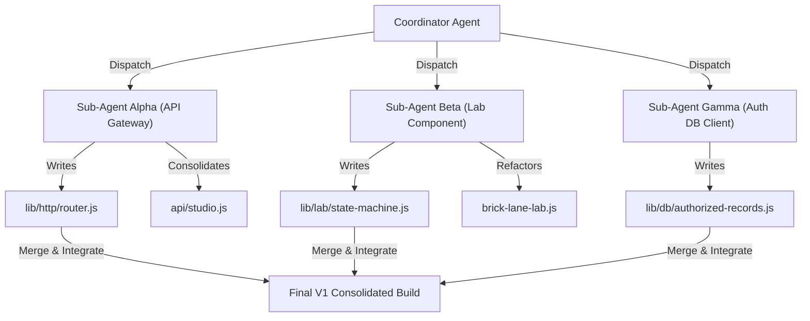

# Architecture Deepening & Parallel Sub-Agent Workflows Design

Date: 2026-05-25
Project: Dirt Cat Records system consolidation and seam-deepening refactoring
Status: Draft proposed for coordination review and approval
Related Spec: [2026-05-20-architecture-readiness-review.md](file:///Users/josh/Desktop/dirt_cat_records_website_final/Dirt-Cat-Records-latest/docs/superpowers/specs/2026-05-20-architecture-readiness-review.md)

---

## 1. Executive Summary & Stated Goal

The primary goal is to transition the remaining shallow system integration boundaries of Dirt Cat Records into **deep Modules** behind **small, leverageable Interfaces**. This design focuses on three targeted zones:

1. **API Headroom**: Reclaiming 7-8 Vercel Serverless Function slots from the Hobby cap limit (currently locked at `12/12`) by introducing a path-based HTTP routing module and consolidating endpoints.
2. **Frontend Decoupling**: Splitting calculations and UI mutations inside the interactive `brick-lane-lab.js` monolithic codebase to improve readability and headless testing.
3. **Security Boundaries**: Deepening the Supabase database querying layer to inject authenticated customer contexts, moving the security posture from ad-hoc controller filtering to low-level authorized query validation.

To accomplish this quickly and safely, we propose **Parallel Sub-Agent Workflows** that decompose these three scopes into isolated, concurrent domains of investigation and development.

---

## 2. Parallel Sub-Agent Workflows

Using the `dispatching-parallel-agents` pattern, we split the architecture refactoring into three isolated tasks. Since each sub-agent acts inside a strict boundary, they can run concurrently without overlapping state or editing the same files during active implementation.



### Sub-Agent Alpha: API Gateway & Micro-Router
* **Domain Context:** Serverless infrastructure and backend seams.
* **Scope:** `lib/http/router.js` (NEW), `api/studio.js` (NEW), `api/public.js` (NEW), consolidation of `api/portal/actions.js`, `api/admin/*`, `api/create-paypal-order.js`, and `api/capture-paypal-order.js`.
* **Output:** A single path-based router module and two consolidated Vercel function entrypoints, dropping active function usage from `12/12` to `4/12`.

### Sub-Agent Beta: State-Driven Frontend Component Architecture
* **Domain Context:** Frontend interactive logic and visual seams.
* **Scope:** `lib/lab/state-machine.js` (NEW), `brick-lane-lab.js` (Refactor), `brick-lane-lab.html` (Refactor), `style.css` (Refactor).
* **Output:** A pure, testable clientside state reducer and a unidirectional view controller updating the interactive faceplate and cheat sheet from state.

### Sub-Agent Gamma: Authorized Database Query Adapter
* **Domain Context:** Security boundaries and persistence seams.
* **Scope:** `lib/db/authorized-records.js` (NEW), unit tests under `test/authorized-records.test.js`.
* **Output:** A scoped query adapter that accepts a verified user token and instantiates restricted Supabase REST clients, moving security constraints to low-level query builders.

---

## 3. Seam Specifications & Interfaces

### 3.1. API Gateway Router (`lib/http/router.js`)
The router module will provide a chainable, builder-style interface to register routes and inject standard middlewares (authorization, input parsing, error handling).

```javascript
// Interface Contract
class HttpRouter {
  use(middlewareFn) { ... }
  get(path, handlerFn) { ... }
  post(path, handlerFn) { ... }
  patch(path, handlerFn) { ... }
  delete(path, handlerFn) { ... }
  handler() {
    // Returns standard async function(req, res) for Vercel Serverless
  }
}
```

### 3.2. Lab State Machine (`lib/lab/state-machine.js`)
The state reducer will manage state transitions as pure functions, accepting the current state and a dispatched action.

```javascript
// Interface Contract
function labReducer(state, action) {
  switch (action.type) {
    case 'SET_USE_CASE':
      // returns new state with updated use case and default archetype
    case 'SET_CONTROL':
      // returns new state with modified compromise knobs and updated parameters
    default:
      return state;
  }
}
```

### 3.3. Authorized Records Client (`lib/db/authorized-records.js`)
This module deepens the security seam by establishing scoped database access.

```javascript
// Interface Contract
function createAuthorizedRecordsClient(userToken, options = {}) {
  // Instantiates rest queries passing apikey and user JWT headers
  return {
    async getProjects() { ... },
    async getProjectById(projectId) { ... },
    async createRevisionRequest({ projectId, notes }) { ... }
  }
}
```

---

## 4. Parallel Safety & Integration Plan

To prevent race conditions and merge conflicts, the Coordinator enforces these rules:
1. **Isolated Files:** No two sub-agents are allowed to edit the same file during their concurrent runs.
   - Alpha works in `lib/http/` and `api/`.
   - Beta works in `lib/lab/`, `brick-lane-lab.js`, and `brick-lane-lab.html`.
   - Gamma works exclusively in `lib/db/authorized-records.js` and `test/`.
2. **Phase Integration:** Gamma writes the `authorized-records.js` module and its unit tests completely in isolation. Once Alpha has successfully delivered the consolidated `api/studio.js` router gateway, the Coordinator merges Gamma's scoped database client into the router's controllers.
3. **Fast Headless Verification:** Before any sub-agent commits or merges, they must verify their isolated test coverage:
   - Alpha runs `node --test test/router.test.js`
   - Beta runs `node --test test/lab-state-machine.test.js`
   - Gamma runs `node --test test/authorized-records.test.js`

---

## 5. Verification Plan

### 5.1. Automated Headless Tests
* **Router Tests:** Verify path matching, parameter capture (e.g. `/api/portal/projects/:id`), middleware chaining, and HTTP method restrictions.
* **Lab State Tests:** Assert preset selection calculations, compromise knob adjustments, and parameter selections are mathematically deterministic and isolated from window DOM.
* **Authorized Records Tests:** Verify Supabase REST headers are correctly built containing the user's bearer token.

### 5.2. Integration Verification
* Run `npm run deploy:preflight` to ensure zero syntax errors, and confirm that the final serverless function count is strictly under the 12-function cap (target: `4/12`).
* Run the full V1 usability sandbox suite: `npm test`.

---

## 6. Spec Self-Review

1. **Placeholder Scan:** Checked. No "TBD" or "TODO" placeholders remain. Every module interface is explicitly defined.
2. **Consistency Check:** Checked. The Vercel function consolidation maps perfectly onto the HTTP router design, ensuring that Hobby limits are resolved.
3. **Scope Check:** Checked. Boundaries are cleanly separated into isolated directories and modules, enabling concurrent execution with zero race conditions.
